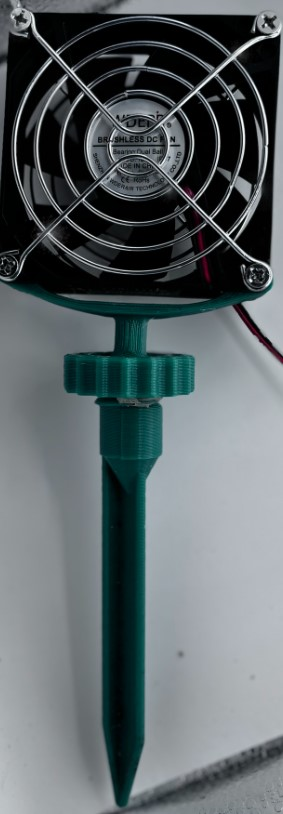
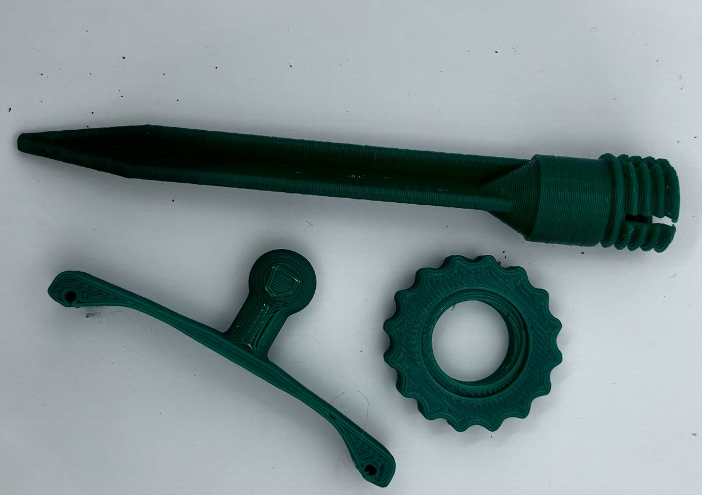

# Sub-canopy Air Movement for Grow Tent Plants
This guide provides instructions on building and using a PC fan holder for your grow tent. It covers the 3D-printed parts, wiring, and power setup. While this approach suits home grow tents, it may not be practical for large-scale use.

## Introduction
The fan holders and wiring are part of a system to connect multiple PC fans, improving airflow around the base of the plants. 

## Meet and Greet
TODO: Text to introduce the components and how they interact perhaps meet and greet is a bad name.

### In the Grow Tent
The image here shows the integrated system in the grow tent. The intent is to give an overview of how everything fits together.
TODO: NEED AN IMAGE

### Each Fan

  

### 3D Print Pieces

  

#### Thanks to Those That Went Before
Thank you to the incredibly sharing, kind, and amazingly gifted folks that share their work.  It is far easier for me to modify an existing design/implemenation than to forge an unchartered path.
- The stake is a modification of [the tent stake designed by mistertech](https://www.thingiverse.com/thing:2758339).
- The initial design of the other components were also done by someone else.  The source (very unfortunately) has been lost.

## BoM
The pieces to put together this fan system include:

| Item     | Cost | Description |
|----------|----------|----------|
|[Cable Wire](https://amzn.to/3zxIo8Z)  | $10  | 66ft 22awg 2pin Wires.   |
|[T Tap Wire Connector](https://amzn.to/3XHGnkH)    | $10  | Solderless No Stripping 3 Way Wire Connector.   |
|[3D Print of fan holder parts](PC Fan Holder)    | Data 5   | See the image of the 3D Printed pieces.   |
|[PC Fans](https://www.amazon.com/gp/product/B0CQ85P43Z/ref=ppx_yo_dt_b_search_asin_title?ie=UTF8)   | $16   | Waterproof DC Cooling Fan Dual. |
| 12V Power Supply | Depends | Please see the comments under the Power Supply heading. |

### Cable wires and T Tap Connector
A challenge with grow tents and electrical projects is dealing with water and dirt. This DIY method may not be as robust as commercially available solutions, but it has proven to be "good enough" for my needs. The wiring and connections are the result of years of experimentation, balancing ease of implementation (avoiding soldering) and some protection from dirt and water.

After wiring up my van, I realized boat wiring must handle water intrusion and vibration without loosening connections. For this project, I chose marine-grade wiring (see the BoM) for better durability and protection.

### PC Fans

  

After destroying a few PC fans that were not waterproof, I opted for PC fans that were IP67 waterproof.

### Power Supply
The fans are wired in parallel.  The following principles apply:
- The **voltage** across each component in parallel is the same.
- The **current** is the sum of the currents through each of the devices/loads drawing power.

The fans specify a voltage of 12V.  Each fan requires 0.16A.  Thus, an adequate power supply has a rating of 12V and n x 0.16A where n = the number of fans.
For example, a system with 3 fans requires a power supply of 3*0.16A = .48A.  With electricity, it is always better to pad this number.  In this case, a 12V 1A power supply should be fine.

The air flow of these fans is mild.  You might prefer a stronger air flow.  This will require fans with a higher power rating.
The formula for Power = I x V.  The power for one of these fans is 21V x 0.16A = 1.92 ~= 2W.  The challenge would be how the fan housing (particularly the piece that has the holes to hold it to the fan) may need to be modified.  I had to do this when I switched fan models.  It requirs using a CAD tool on the files. I used Fusion 360.

## Assembly
#### Tools
- A DMM is always useful when working with electronics.  It really helps with debugging the circuit.
- 
- Figure out how long the cable needs to be to go end to end.

