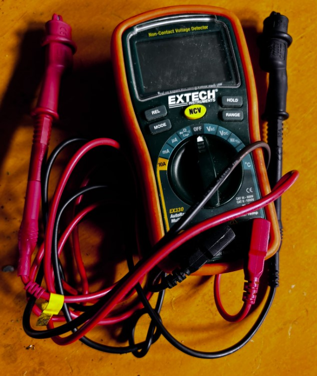
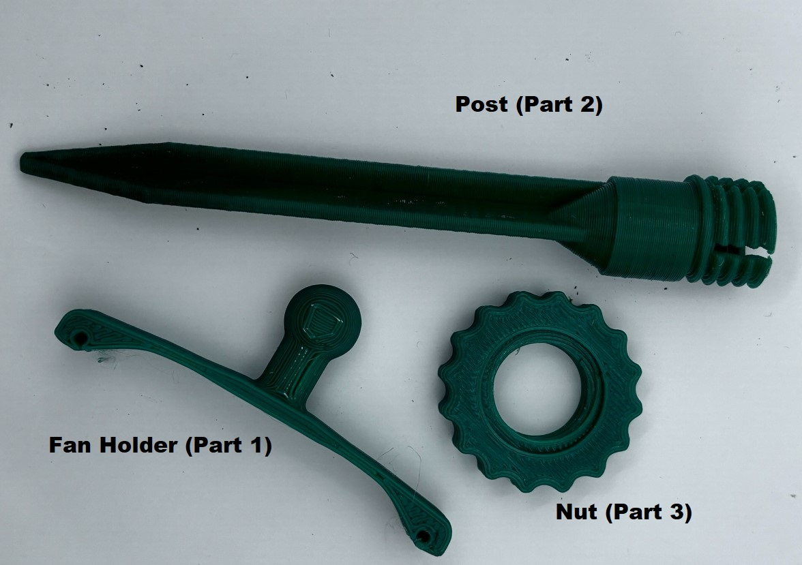
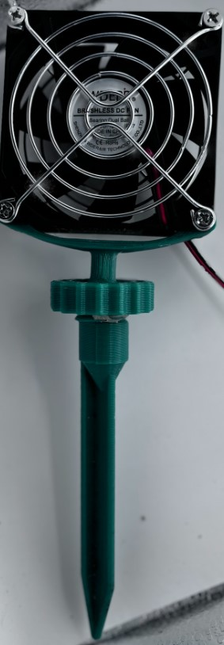
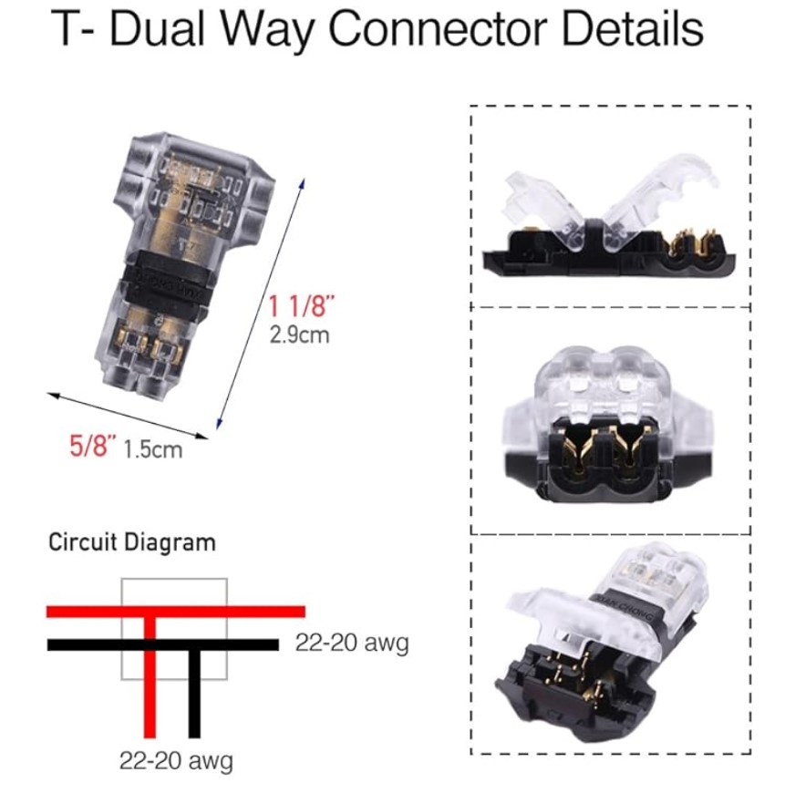
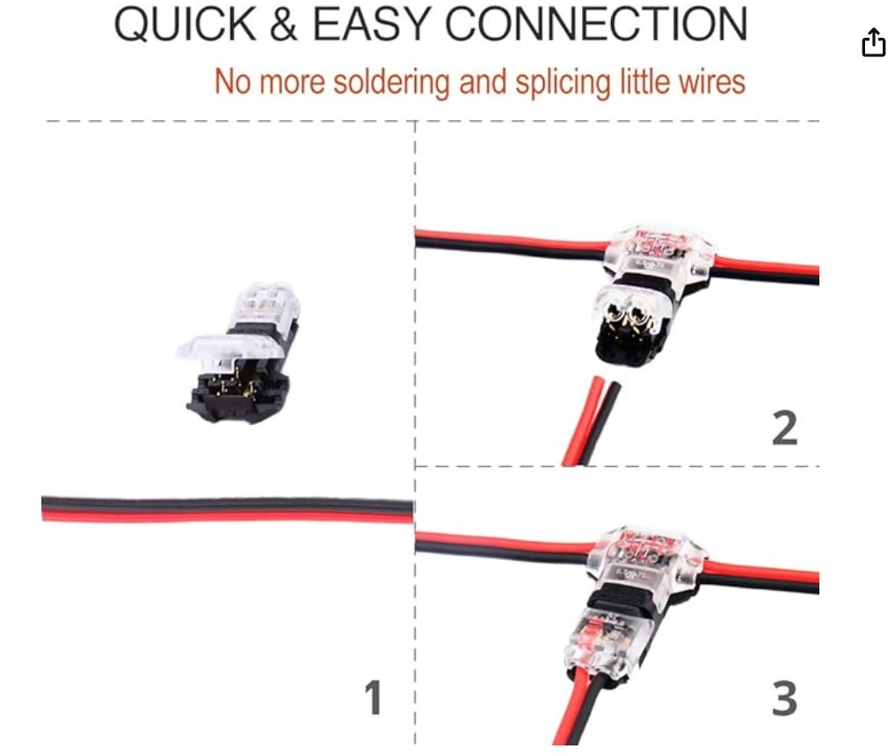

# Sub-canopy Air Movement fUsing PC Fans for Grow Tents
This guide provides instructions on building and using a PC fan holder for your grow tent. It covers the 3D-printed parts, wiring, and power setup. While this approach suits home grow tents, it may not be practical for large-scale use.

## 👋 Introduction
The fan holders and wiring are part of a system to connect multiple PC fans, improving airflow around the base of the plants.  The design of the fan holder allows the fan to be posted into the ground.  The fan can swivel because of the ball joint.

## Meet and Greet
TODO: Text to introduce the components and how they interact perhaps meet and greet is a bad name.

### 🌱 In the Grow Tent
The image here shows the integrated system in the grow tent. The intent is to give an overview of how everything fits together.
TODO: NEED AN IMAGE

#### ❤️ 🙏 Thanks to Those That Went Before
**Thank you to the kind, and amazingly gifted folks that share their work.**  It is far easier for me to modify an existing design/implemenation than to forge an unchartered path.
- The actual fan holder parts is a modification of [**Brundak's** Fan holder - desk fan on printables](https://www.printables.com/model/272507-fan-holder-desk-fan)
- The stake is a modification of [the tent stake designed by **mistertech**](https://www.thingiverse.com/thing:2758339).

## 📜BoM
The pieces to put together this fan system include:

| Item     | Cost | Description |
|----------|----------|----------|
|[Cable Wire](https://amzn.to/3zxIo8Z)  | $10  | 66ft 22awg 2pin Wires.   |
|[T Tap Wire Connector](https://amzn.to/3XHGnkH)    | $10  | Solderless No Stripping 3 Way Wire Connector.   |
|[3D Print of fan holder parts](PC Fan Holder)    | Data 5   | See the image of the 3D Printed pieces.   |
|[PC Fans](https://www.amazon.com/gp/product/B0CQ85P43Z/ref=ppx_yo_dt_b_search_asin_title?ie=UTF8)   | $16   | Waterproof DC Cooling Fan Dual. |
| 12V Power Supply | Depends | Please see the comments under the Power Supply heading. |

### 🔗Cable wires and T Tap Connector
A challenge with grow tents and electrical projects is dealing with water and dirt. This DIY method may not be as robust as commercially available solutions, but it has proven to be "good enough" for my needs. The wiring and connections are the result of years of experimentation, balancing ease of implementation (avoiding soldering) and some protection from dirt and water.

After wiring up my van, I realized boat wiring must handle water intrusion and vibration without loosening connections. For this project, I chose marine-grade wiring (see the BoM) for better durability and protection.

### 💨 PC Fans
After destroying a few PC fans that were not waterproof, I opted for PC fans that were IP67 waterproof.

### 🔌 Power Supply
The fans are wired in parallel.  The following principles apply:
- The **voltage** across each component in parallel is the same.
- The **current** is the sum of the currents through each of the devices/loads drawing power.

The fans specify a voltage of 12V.  Each fan requires 0.16A.  Thus, an adequate power supply has a rating of 12V and n x 0.16A where n = the number of fans.
For example, a system with 3 fans requires a power supply of 3*0.16A = .48A.  With electricity, it is always better to pad this number.  In this case, a 12V 1A power supply should be fine.

The air flow of these fans is mild.  You might prefer a stronger air flow.  This will require fans with a higher power rating.
The formula for Power = I x V.  The power for one of these fans is 21V x 0.16A = 1.92 ~= 2W.  The challenge would be how the fan housing (particularly the piece that has the holes to hold it to the fan) may need to be modified.  I had to do this when I switched fan models.  It requirs using a CAD tool on the files. I used Fusion 360.

## 🔩 Assembly
### 🛠️ Tools
- A DMM(Digital MultiMeter) is always useful when working with electronics.  It really helps with debugging the circuit.  This is the one I have used for quite awhile:

  

- A pair of (small works great) wire clippers or scissors. The cables are only 22AWG gauge so scissors will work fine.

- Access to a 3D printer to print the fan holder parts.

### 👣 Assembly Steps
#### 🖨️ 3D Printed Parts
1. 🖨️ Print out the parts.

> **Note** Each PC fan requires it's own set of 3D printed parts.

This document asumes familiarity with 3D printing.  The filament that was used was two year old PLA that was on hand.  The settings were the default for PLA.  The 3D printer used was a [Prusa MK3S](https://www.prusa3d.com/category/original-prusa-i3-mk3s/).

As shown in the image, there are three different pieces that come together to make the fan holder.

  

Here are the components put together:

  

Refer to the above image to map the file to the 3D printed component.  Each one needs to be printed for each fan. The files for printing include:

- fan_holder (PART 1)v2.3mf

> **Note:** A .3MF file (3D Manufacturing Format) is a file format used for 3D printing. It contains a mesh, which is a collection of vertices, edges, and faces that defines the shape of a 3D object.  The file format evolves the STL file format with additional information such as colors, textures, materials, and other properties. This file was created by Fusion 360. It is typically opened within slicer software.  PrusaSlicer was used to print the components on the MK3S 3D Printer.

- post (Part 2)v3.3mf

- Nut (Part3).stl

2. 🏗️ Assemble

- Mount the fan holder (Part 1) to the PC fan using the long bolts provided by the distributors of the PC fan.  The first screw is easy to insert.  To get the holes aligned for the second screw to go in, the fan holder is squished until the holes aligned.
- Put a small strip of duct tape or similar around the ball of the fan holder (Part 1).  This makes for a snug fit into the top of the post.  With the nut Part 3) on the neck of the fan holder (Part 1).  Press the ball inside the hole at the top of the nut and then screw the nut down.  Given the connection is (rough) plastic on (rough) plastic, it may be difficult to screw down to far but it should grasp and screw down a bit.
> **NOTE** The PC fan should be able to swivel a bit.

### 🔗 Wiring
1. Lay out the end-end length of cable.
2. Space out the T-tap connectors along the length of cable where you want to place the fans and the power source.
3. Attach the fan and the power source to the cable. You can choose to attach the fans to the connectors first or the connectors to the long wire first.  **Just make sure to follow the wiring shown in the images below**. The connectors were chosen because they provide shielding, secure connection, and don't require soldering. With that said, negatives of this connector choice include the friction introduced because the connection is based on a prick into the cable instead of a nice full solder with heat shield. This assumes the solder is well done. Also, the amount of force to get the plastic lids to clamp down makes it just a bit difficult to clamp the connection securely.  Yet given the negatives, this choice of wiring and connection have worked best for wiring low power DC devices like most PC fans.

> **Note** Consider running connectivity tests between different wire inputs and outputs.  It is easier to do this now than to wait when everything is wired up.  It is best to go slow and verify step by step when wiring.

  

  

> **Note** Check the wiring and make sure the red and black wires are in their correct location.  Once verified, check again.  It is not uncommon to have wires crossed...

4. Before you plug in the power supply (in the case wires are crossed which could short out the power supply), walk through the troubleshooting steps.

5. Place the fans so they won't freak out or fall of anything then plug in the power supply and hopefully watch as the blades glide around.

#### 😟 Troubleshooting

You plug in the power supply and nothing happens.  Common causes include:
1. The connector has wires crossed.  View the above images closely and verify they match your wiring.
2. There is not an end to end connection.  Run connectivity tests between the input and output wires.
3. The power supply is not working - use a DMM to determine if there is a 12V DC Voltage reading.
4. Verify the power supply is 12V and can handle a load of n x 0.16A where n = the number of PC fans running in parallel along the wired circuit.
5. If you encounter a bug, have a feature request, or need assistance, submit an issue by navigating to the Issues tab of this repository.

## 👋 Bye for now

Thank you for following this guide. If you have any questions or need further assistance, feel free to open an issue on GitHub.

😺 Please find many things to smile about. 😀

