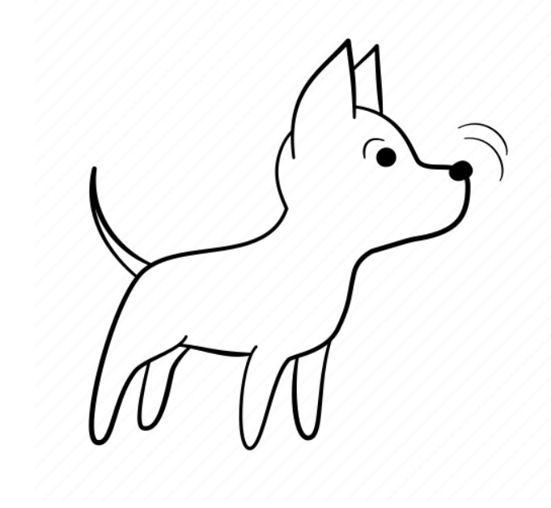

(snifferbuddy)=
# SnifferBuddy
:::{div}

:::


## About {material-regular}`question_mark;1em;sd-text-success`
:::{div}

:::

sniff...sniff...sniff...SnifferBuddy happily hangs around in a grow tent sending out mqtt messages containing air quality readings (like temperature, humidity, CO2, etc.) over a home's wifi.   There is a photoresistor at the top of SnifferBuddy to indicate whether the grow lights are on or off. The messages are sent to the growBuddy broker. This is an  mqtt broker that runs on the growBuddy server.   The star of SnifferBuddy is the [SCD30 sensor from Adafruit](https://www.adafruit.com/product/4867) . The sensor is what provides the temperature, RH, and CO2 values.  SnifferBuddy talks with the other Buddies using mqtt which is provided by [Tasmota firmware](https://tasmota.github.io/docs/About/).  The mqtt messages must be picked up by the growBuddy broker to be useful.

:::{figure} images/snifferbuddy_in_growtent.jpg
:align: center
:height: 350

A Happy SnifferBuddy hanging about
:::

The one I made looks like this:

:::{figure} images/snifferbuddy_real.jpg
:align: center
:height: 350

SnifferBuddy
:::
(make_snifferbuddy)=
## Let's Make One {material-regular}`build;1em;sd-text-success`
```{note}
SnifferBuddy sends out mqtt messages in which the payload includes the sensor readings.  You can use any mqtt environment to interact with a SnifferBuddy.  If you have built [Gus](gus), Gus will know what to do with the SnifferBuddy messages.  This document assumes [Gus](gus) has been built.
```


Once plugged in and working, you will be able to (compliments of [Gus](gus)):
- Store readings into an influxdb table (referred to as a measurement within influxdb terminology) influxdb.
- Visualize your readings using grafana.
### Gather The Materials

- [SCD30 sensor](https://www.adafruit.com/product/4867) component.
- [ESP8286](https://www.aliexpress.us/item/2251832645039000.html) component.
- Photoresistor and 10K through hole resistor.  I had alot of these kicking around. I bought something similar to [this kit](https://amzn.to/3yNZtZd).
- 3D printer and PLA filament for printing out [the enclosure](enclosure).
- Superglue for gluing the top Wemos part of the enclosure to the cap part of the enclosure.
- USB chord and to plug the ESP8286 to power.
- 4 4mm M2.5 or M3 bolts.

### Make the Enclosure

The SnifferBuddy enclosure was designed within Fusion 360 and printed on a Prusa MK3s using PLA filament.  I use the F360  app extension [Parameter I/O](https://apps.autodesk.com/FUSION/en/Detail/Index?id=1801418194626000805&appLang=en&os=Win64) to import/export the parameters found in [SnifferBuddyParams.csv](https://github.com/solarslurpi/GrowBuddies/blob/c100124acaab285eadb284a5e7015e569ed76d3c/enclosures/SnifferBuddy/SnifferBuddyParams.csv).

To make the enclosure, download and print the ([4 mesh files](https://github.com/solarslurpi/growBuddy/tree/main/enclosures/SnifferBuddy)).
:::{figure} images/snifferbuddy_parts_on_printer_plate.jpg
:align: center
:height: 350

SnifferBuddy Enclosure Parts
:::
- [WemosD1_top.stl](https://github.com/solarslurpi/growBuddy/blob/main/enclosures/SnifferBuddy/WemosD1_top.stl)
- [WemosD1_base.3mf](https://github.com/solarslurpi/growBuddy/blob/main/enclosures/SnifferBuddy/wemosD1_base.3mf)
- [scd_cap.3mf](https://github.com/solarslurpi/growBuddy/blob/main/enclosures/SnifferBuddy/scd_cap.3mf)
- [scd30 enclosure.stl](https://github.com/solarslurpi/growBuddy/blob/main/enclosures/SnifferBuddy/scd30%20enclosure.stl)

[The directory](https://github.com/solarslurpi/growBuddy/tree/main/enclosures/SnifferBuddy) also includes the Fusion 360 files, including [a Fusion 360 file of a Wemos D1](https://github.com/solarslurpi/growBuddy/blob/main/enclosures/SnifferBuddy/_Wemos.8a6fa8fd-bdae-4608-9551-e9ac450bc9c8.f3d) for modeling.


### Wire the Components Together
The SCD30 and photoresistor are wired to  an [ESP826 D1 mini](https://i2.wp.com/randomnerdtutorials.com/wp-content/uploads/2019/05/ESP8266-WeMos-D1-Mini-pinout-gpio-pin.png?quality=100&strip=all&ssl=1).
:::{figure} images/SnifferBuddy_wiring.jpg
:align: center
:scale: 100

SnifferBuddy Wiring
:::

I settled on the ESP826 because I settled on [Tasmota](https://tasmota.github.io/docs/)  as the way to send sensor readings over mqtt.
I figured if [Tasmota's goal](https://tasmota.github.io/docs/About/) was to *"provide ESP8266 based ITEAD Sonokff devices with MQTT and 'Over the Air' or OTA firmware"...*
Then why not use the same chip?   I {ref}`ran into an issue with the Wemos D1 ESP286<wemos_challenges>` when I made the first SnifferBuddy.  But for the most part, ESP826's are very
inexpensive and work.  I ordered some from [Aliexpress](https://www.aliexpress.us/item/2251832645039000.html).  I put a Photoresistor on the top as a way to determine
if the grow lights were on or off.  I use this for knowing when to go into daytime or nightime care.

(scd30_wiring)=
#### WemosD1 to SCD30 Wiring

Thanks to vendors like [Adafruit](https://www.adafruit.com/), we have a vast amount of sensors and microcontrollers that we can connect together.  However, only a few companies (like Adafruit) include connectors on their Breakout Boards.  I like the idea of standardizing on a couple of JST connectors and discuss that more in [the wiring section](wiring)

:::{figure} images/wemosd1_wiring.jpg
:align: center
:scale: 100

Wemos D1 Wiring
:::

The Photoresistor is "hard wired" to the ESP286's analog pin.  The SCD30 is an I2C device.  Since I may want to reuse the SCD30, and I want to make the connection cleaner, I will use a JST SH connector.


### Install Tasmota
Time to install Tasmota onto the ESP8286.  See [Tasmota Installation](tasmota_installation).

#### Verify Install
You can use a tool like [mqtt explorer](mqtt_explorer) to see if SnifferBuddy is sending out mqtt messages.

## Store Readings {material-outlined}`storage;1em;sd-text-success`
(snifferbuddy_storereadings)=
### code/examples/snifferbuddy_storereadings.py

```{eval-rst}
.. automodule:: code.examples.snifferbuddy_storereadings
   :members:
```
## About Logging
```{eval-rst}
.. automodule:: code.logginghandler
   :members:
```