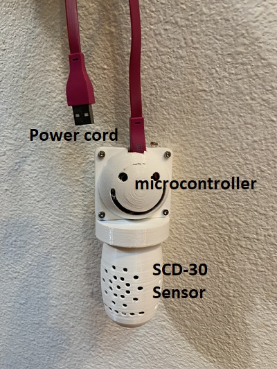
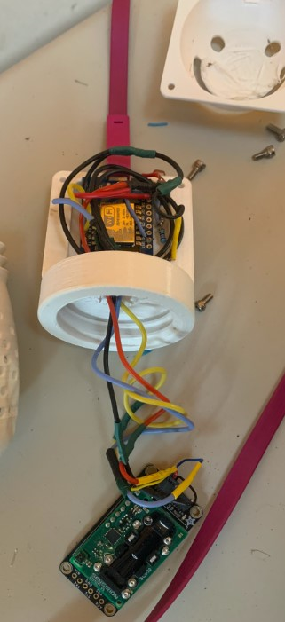
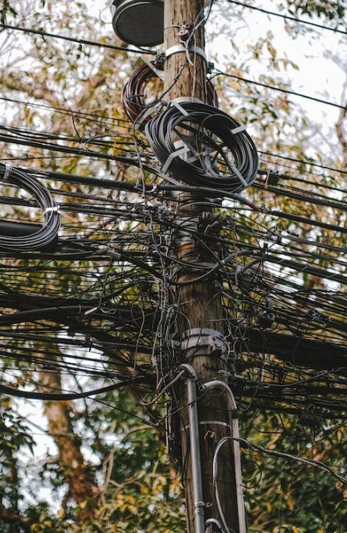

************
SnifferBuddy
************

SnifferBuddy sniffs out values for the air temperature, CO2 level, and humidity. I also put in a photoresiter on top to let me know when 
the LEDs are on or off.  The readings are sent out over wifi using mqtt to the GrowBuddy broker.  

Putting a SnifferBuddy together is easy. The hardest part is soldering the wires to the pins!

The one I made looks like this:

   SnifferBuddy 

Hardware
**********
The star of SnifferBuddy is the `SCD30 sensor from Adafruit <https://www.adafruit.com/product/4867>`_ .  I had one in my parts bin.  The SCD30 is wired to  an
`ESP826 D1 mini <https://i2.wp.com/randomnerdtutorials.com/wp-content/uploads/2019/05/ESP8266-WeMos-D1-Mini-pinout-gpio-pin.png?quality=100&strip=all&ssl=1>`_ I had 
in my parts bin.  I settled on the ESP826 because I settled on `Tasmota  <https://tasmota.github.io/docs/>`_  as the way to send sensor readings over mqtt.  
I figured if `tasmota's goal <https://tasmota.github.io/docs/About/>`_ was to *"provide ESP8266 based ITEAD Sonokff devices with MQTT and 'Over the Air' or OTA firmware"...*
Then why not use the same chip?  On the one hand, I have used ESP826 microcontrollers in the past with mixed results.  On the other hand, ESP826's are very 
inexpensive and work.  I ordered some from `Aliexpress <https://www.aliexpress.us/item/2251832645039000.html>`_.  I put a Photoresistor on the top as a way to determine
if the grow lights were on or off.  I use this for knowing when to go into daytime or nightime care.

Wiring
------
What a mess.  I won't even try to make a pretty image.  There is no way...I have started to standardize on wiring between components.

   SnifferBuddy Wiring

What a mess.  I won't even try to make a pretty image.  There is no way... Thank goodness I am not a professional like this person.

The good news is the wiring works.  Wiring is components together - like the ESP286 and the SCD30 - is probably the hardest part of working with hardware for the DIYer.  Previously, I might have built a custom PCB but that takes time and besides the folks - like Adafruit - making components really know how to surround the component with robust circuits that typically don't start on fire. *Note: I haven't had an ESP286 catch on fire, but I've had a few get really warm*

Software
********

Enclosure
*********
The enclosure was designed within F360 and printed on a Prusa MK3s.  Files within the enclosure folder include:

-  `GrowBuddyParams.csv <https://github.com/solarslurpi/GrowBuddy/blob/main/enclosure/GrowBuddyParams.csv>`_ : settings imported into F360.
-  `Fusion 360 and 3mf files <https://github.com/solarslurpi/GrowBuddy/tree/main/enclosure>`_ 
