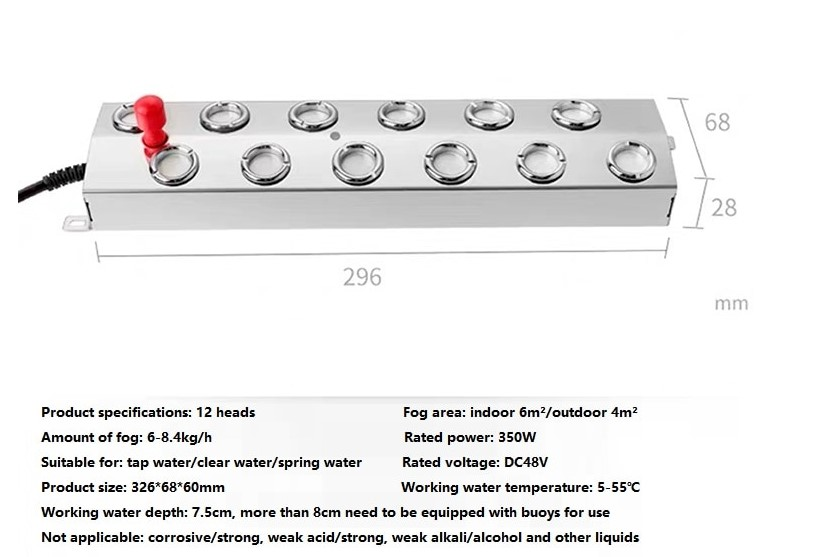

# MistBuddy
mistBuddy is a DIY "Smart" Humidifier.  I built one because I couldn't find anything that worked as well.  Things that make me happy about mistBuddy:
- it can be told to be turned on or off over a home's wifi.
- it can be automatically refilled.
- it supplies a lot of vapor.
- it is fun and simple to make.

## Glamour Shot
:::{figure} images/humidifier.jpeg
:align: center
:scale: 80

DIY Humidifier
:::
### Materials

The materials I used to make the humidifier in the image include:
- [Storage Tote from Home Depot](https://www.homedepot.com/p/HDX-14-Gal-Tough-Storage-Tote-in-Black-with-Yellow-Lid-SW111/314468098).
- [2 in. PVC Pipe from Home Depot](https://www.homedepot.com/p/JM-EAGLE-2-in-x-10-ft-White-PVC-Schedule-40-DWV-Plain-End-Pipe-531137/100161954).
- [2 in. PVC 90° elbow](https://www.homedepot.com/p/Charlotte-Pipe-2-in-PVC-DWV-90-Degree-Hub-x-Hub-Elbow-PVC003001000HD/203393418).
- Fan from a PC.  We have an electronics parts store near me that has a box full of PC fans.  The one I am using is quite strong, running at 24V.
    - A 24 V Power Supply will be needed to drive the fan.
- [Mist maker from Aliexpress](https://www.aliexpress.com/item/3256803543458943.html?spm=a2g0o.order_list.0.0.57dd1802LzMQr6).  After trying out the one I got, I could imagine getting one half the strength.  Someday I'll figure out how to do the back of the envelope calculations to get exactly what I need...but for now I do what I alwasy do, I bumble on!

:::{image} https://www.aliexpress.com/item/3256803543458943.html?spm=a2g0o.order_list.0.0.57dd1802LzMQr6
:align: center
:scale: 80

The one I got specifies a 48VDC power source rated at 350W.  Looking at `Power(P) = Voltage(V)*Current(I)`, I'm interested in how much current is needed. I = 350W/48VDC = 7.3 Amps.  Which is a significant amount!  I had a 48V 250W power supply that I am using which works.  In fact, it is overkill for my space!
    - A 48V Power Supply rated at at least 250W is needed to drive the mister.
#### Continuous Fill
- [Float Valve](https://www.youtube.com/watch?v=vmiO6Z_HLCE)
- [1/2" Barb to 1/2 " NPT female connector](https://amzn.to/3yzxlsG) _Note: The connector fittings assumes 1/2" PEX connector to incoming water_.
#### Remotely turn ON/OFF
- Two Sonoff S31 plugs that have been [Tasmotized](flash_S31). I bought a [pack of four from Amazon](https://amzn.to/3xnPWYc).
### Build Directions
#### Building the Base and Continuous Fill Features
For the base and continuous fill, get the popcorn ... it's time for a [How To YouTube Video on making a DIY Humidifier](https://www.youtube.com/watch?v=vmiO6Z_HLCE)

The water level for the float valve is 1 cm above the sensor line.

:::{figure} images/mister_water_level.jpg
:align: center
:scale: 80

Mister Water Level
:::
#### Building the Remotely turn ON/OFF Feature
To do this, two [Sonoff S31 plugs](https://amzn.to/3xnPWYc) needs to be [flashed with Tasmota](flash_S31).

