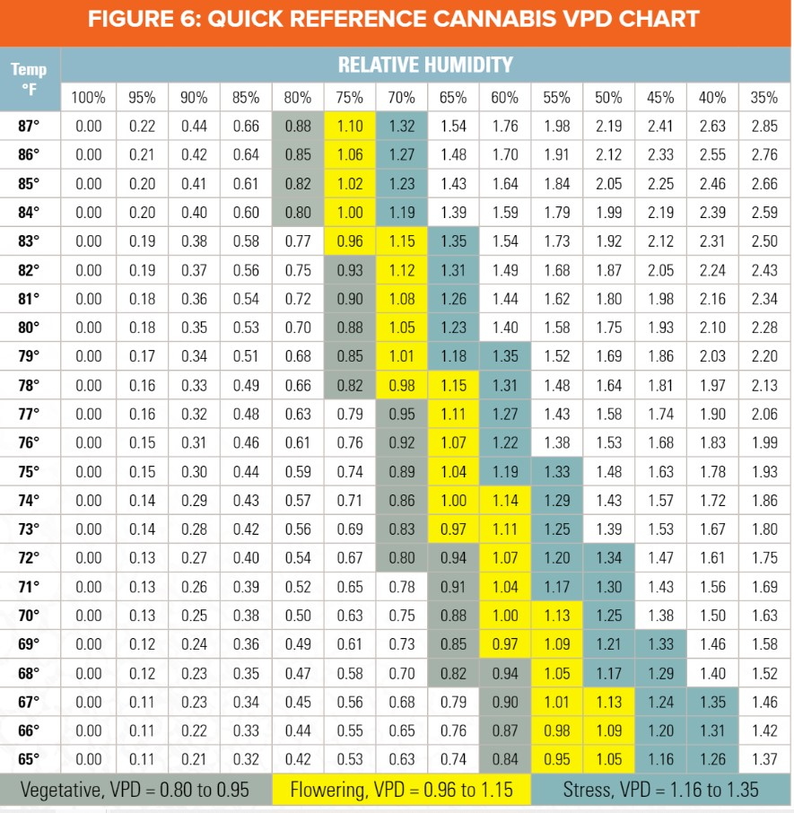

********
VPDBuddy
********

VPDBuddy works to make sure the `Vapor Pressure Deficit (VPD) <https://en.wikipedia.org/wiki/Vapour-pressure_deficit>`_ is within an "ideal" range.  The source for the ideal range is the `Flu Cultivation Guide  <https://github.com/solarslurpi/GrowBuddy/blob/main/docs/FLU-CultivationGuide_Cannabis_WEB_PROOF_01-2020.pdf>`_ .  Figure 6 notes an ideal VPD range during the:

- vegetative state is 0.8 to 0.95
- flower state is 0.96 to 1.15

If the ideal VPD values are maintained during vegetative and flowering state, VPDBuddy is doing it's job!

Resources
=========

- `YouTube video that I found best explained water vapor, temperature's relationship to Relative Humidity and VPD <https://www.youtube.com/watch?v=-bYPGr1TJQY&t=1s>`_.  
- `YouTube video introducing InfluxDB <https://www.youtube.com/watch?v=Vq4cDIdz_M8&list=RDCMUC4Snw5yrSDMXys31I18U3gg&index=2>`_.

System Overview
===============

    

