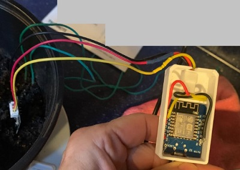

..  _wiring:

******
Wiring
******
Wiring components together is my biggest source of frustration with projects in which I use components like an `ESP286 <https://i2.wp.com/randomnerdtutorials.com/wp-content/uploads/2019/05/ESP8266-WeMos-D1-Mini-pinout-gpio-pin.png?quality=100&strip=all&ssl=1>`_ and  `SCD30 sensor <https://www.adafruit.com/product/4867>`_.  Besides the confusing ugliness of my thoughtless wiring,

.. figure:: images/SnifferBuddy_innerds.jpg
   :align: center
   :height: 350

   SnifferBuddy Wiring

The haphazard wiring is prone to lose connection or cause a short.

Just Pick One
=============

I like the direction companies like Adafruit are going by standardizing on a specific connection.  I am picking up Adafruit's  `stemma <https://learn.adafruit.com/introducing-adafruit-stemma-qt>`_  sdtyle of connecting components.  
- STEMMA connectors are 3 or 4 pin JST PH connectors.  The pins of these connectors are 2mm apart (i.e.: 2mm pitch)
- STEMMA QT connectors are 3 or 4 pin JST SH connectors.  These connectors are quite small.  The pins are at a 1mm pitch.

For some reason, I find JST connectors confusing.  I oddly found some relief to find out I'm not alone in my confusion.

Awesome Articles on JST
+++++++++++++++++++++++

-  Why JST "connectors" gets complicated and the importance of thinking about connectors up front: `JST IS NOT A CONNECTOR <https://hackaday.com/2017/12/27/jst-is-not-a-connector/>`_ .
-  One man's voyage through the JST jungle:  `JST Connector Crimping Insanity <https://iotexpert.com/jst-connector-crimping-insanity/>`_ .

Moving forward, I will stick to STEMMA and STEMMA QT connector types.

Wiring GrowBuddy Components Together
====================================

To wire an ESP286 to a STEMMA QT, I ordered a `pre-crimped STEMMA/JST PH 2.0 cable kit <https://amzn.to/3SLurIX>`_ .  I noticed at least one of the comments expressed outrage in the high price and we should just all crimp the wires ourselves.  I guess we could.  But it would take too much practice so in my equation, the extra money was well worth the time savings.

Example
+++++++
Here's a wiring of a soil moisture sensor I recently did.

The enclosure has a connector area where the JST connector snuggly fits.